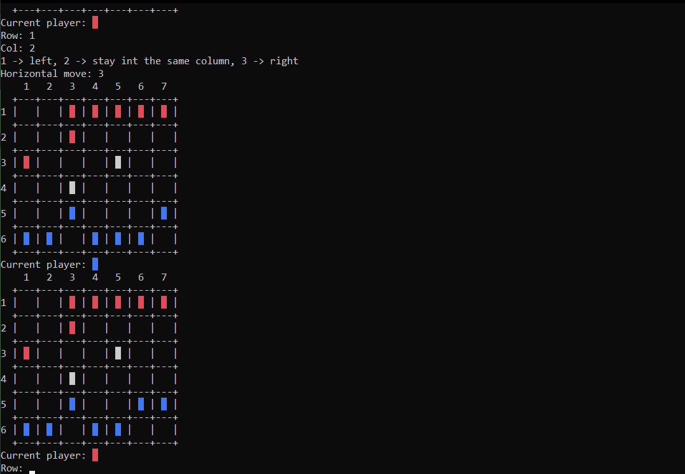

# 2.4. feladat
## Feladatleírás
Adott az ábrán látható 6 × 7 mezőből álló tábla, rajta 7 piros és 7 kék
koronggal. 

Az egyik játékos a piros, a másik a kék színű korongokkal játszik.
Felváltva következnek lépni, egy lépésben egy saját színű korongot kell elmozd
ítani:
 - A korong előre vagy átlósan előre léphet egy mezőt, ha így üres mezőre
kerül.
 - A korong átlósan előre léphet egy mezőt, ha így olyan mezőre kerül,
amelyen az ellenfél egy korongja van. Ezt a korongot le kell venni a
tábláról.

A sötét mezők tiltottak, amelyekre nem lehet lépni. Veszít a lépni következő
játékos, ha nem tud lépni.
## Alkalmazás

